```mermaid
graph LR
    A[🗃️ methods/*.yaml] --> B[🐍 generate_methods.py]
    B --> C[📄 docs/methods*.rst]
    C --> D[🔧 Sphinx]
    D --> E[🌐 Read the Docs]
    
    style A fill:#e1f5fe
    style B fill:#f3e5f5
    style C fill:#fff3e0
    style D fill:#e8f5e8
    style E fill:#fce4ec
```

# Interpretation, Extrapolation, and Perturbation of Single cells

[](https://interp-extrap-perturb.readthedocs.io/en/latest/)
[](https://github.com/dbdimitrov/interp-extrap-perturb/stargazers)
[](LICENSE)
[](docs/source/contribute.rst)

---

## 🎯 **Overview**

A **living catalogue** 📚 of computational methods that attempt to identify mechanistic cause‑and‑effect links and predict responses in unobserved settings.
The project curates **> 100 peer‑reviewed and pre‑print tools**, classifies them by task, and provides a browsable web interface with informative tables and technical descriptions.

---


## 🔗 **Quick Access**

| 🎯 **Resource**              | 🌐 **URL**                                                                                     |
| ----------------------------- | ---------------------------------------------------------------------------------------------- |
| 📖 **Documentation**         | [https://interp-extrap-perturb.readthedocs.io/](https://interp-extrap-perturb.readthedocs.io/) |
| 🤝 **Contribute**            | [Contribution Guidelines](docs/source/contribute.rst) - *Add your method!*                   |

---

## 🤝 **Contributing**

We welcome contributions! 🎉 Whether you want to:

- 🆕 **Add a new method** — Create a YAML file in `methods/`
- ✏️ **Update existing methods** — Edit the corresponding YAML file  
- 🐛 **Report issues** — Open an issue on GitHub
- 💡 **Suggest improvements** — We're always open to ideas!

👉 **Get Started**: Check our [📋 Contribution Guidelines](docs/source/contribute.rst) for detailed instructions.

---

## 🔄 Data flow

```
methods.yaml ─▶ generate_methods.py ─▶ docs/methods*.rst ─▶ Sphinx ▶ Read the Docs
```

1. **`methods.yaml`** — canonical metadata (method, year, tasks, code link, …).
2. **`generate_methods.py`** converts YAML → ReStructuredText via Jinja2:

   * One overview page (`methods.rst`).
   * One page per task (slugified).
     Tasks are listed in `tasklist.txt`; unknown tasks raise a warning.
3. Sphinx + *sphinx‑book‑theme* renders the site; ReadTheDocs rebuilds on each push.

---




---

### 📋 **Process Steps:**

1. **📁 Individual YAML Files** — Each method stored as `methods/method_name.yaml` with structured metadata
2. **🛠️ Generation Script** — `generate_methods.py` converts YAML → ReStructuredText via Jinja2:
   - 📊 One overview page (`methods.rst`) with sortable table
   - 🏷️ One page per task category (auto-slugified)  
   - ⚠️ Tasks validation against `tasklist.txt`
3. **📚 Sphinx Rendering** — Uses *sphinx‑book‑theme* for professional styling
4. **🚀 Auto-Deployment** — ReadTheDocs rebuilds on each push to `main`


## 📄 **Citation & License**

If you use this catalog in your research, please cite our perspective paper *(under review)*.

**License**: MIT © 2025 Daniel Dimitrov, Stefan Schrod, Martin Rohbeck & Oliver Stegle

---

## License

MIT © 2025 Daniel Dimitrov, Stefan Schrod, Martin Rohbeck, Oliver Stegle
