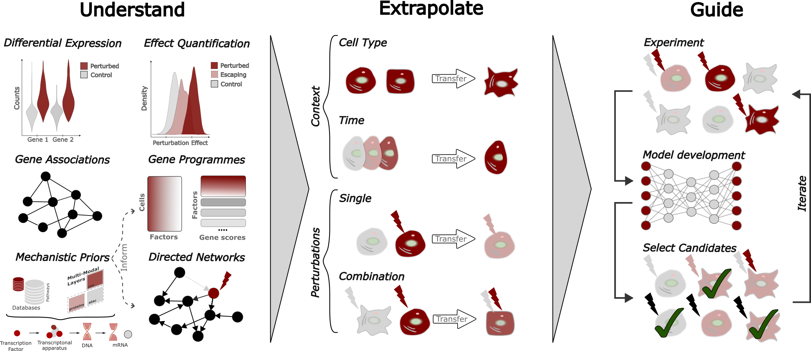

Interpretation, Extrapolation, and Perturbation of Single cells
===============================================================

Single-cell genomics is moving beyond cell atlases toward models that interpret and extrapolate cellular responses to perturbations. 
This webpage lists technical details for more than 100 of these methods. Moreover, as part of a perspective (*under review*), 
it aims to help researchers pick the right tool and highlight open challenges for future method advances.

   Goals of Emerging Causal and Mechanistic Single-Cell Methods

.. toctree::
   :maxdepth: 2
   :caption: Contents

   methods
   contribute