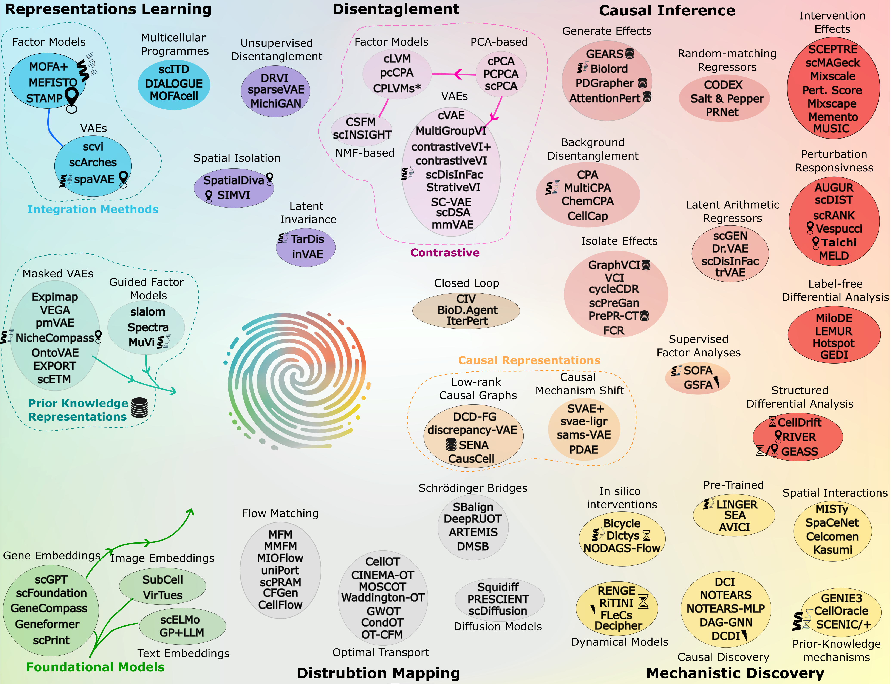

Interpretation, Extrapolation, and Perturbation of Single cells
================================================================

   
   An Ontology of Emerging Causal and Mechanistic Single-Cell Modeling Methods  
   
.. toctree::
   :maxdepth: 1

   methods
   contribute
   